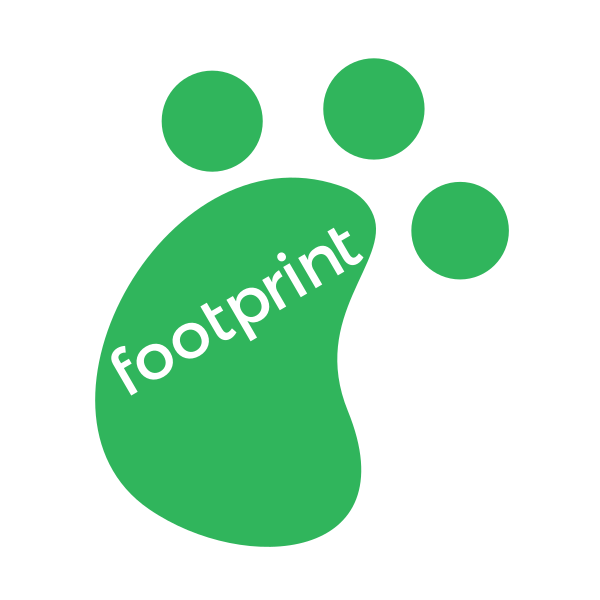
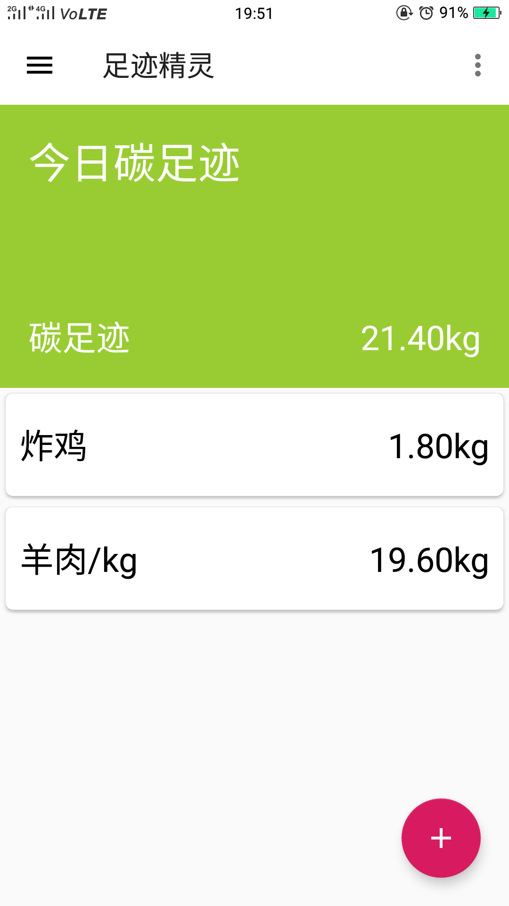
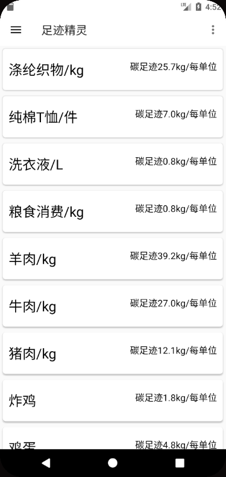
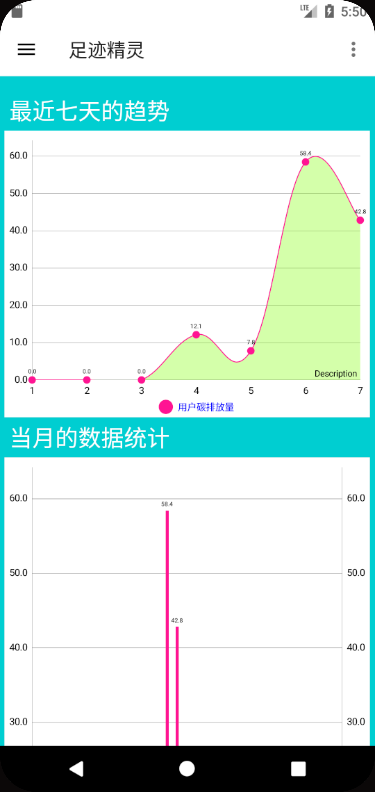

# footMemory
An android app aimed at promoting environment protection by recording and analyzing carbon footprint.

# Introduction
Every person will generate carbon dioxide and greenhouse gases in their life everyday. A carbon footprint is the total amount of greenhouse gases that are generated by our actions. Because of the global warming, it is emergent for humans to lead a low carbon life. footMemory application is developed as a simple tool for everyone to calculate, record, and analyze their carbon footprint. In this way, users can find how to lower their carbon footprint every day systematically. 
# Techniques
The app is achieved by **Java** and **Android Studio**. 
# Samples Showcase

**Everyday Footprint Record Page**

Used to show what activities users do today and how much carbon footprint is generated. For example, in this sample page, the user eats one unit of chicken and one unit of mutton, so the corrosponding carbon footprint is 21.40kg. 

**Calculator Data Page**

Calculator part provided the relationships between activities and carbon footprint. For example, a T-shirt will generate 7.0kg carbon dioxide from its production, shipment and so on. The user can click the activity they do and enter the units they do, so the app will record corresponded footprint. 

**Historical Data**

# License

This work is licensed under a [Creative Commons Attribution 4.0 International License](http://creativecommons.org/licenses/by/4.0/)
